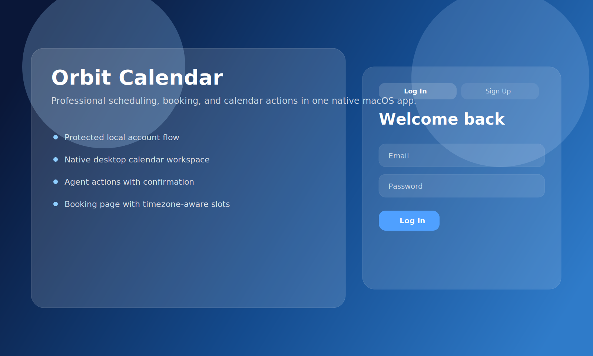
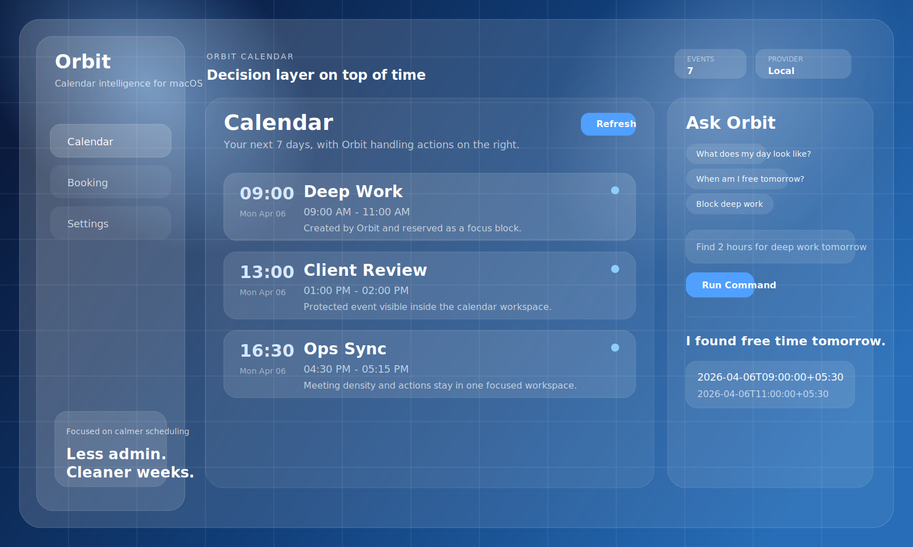
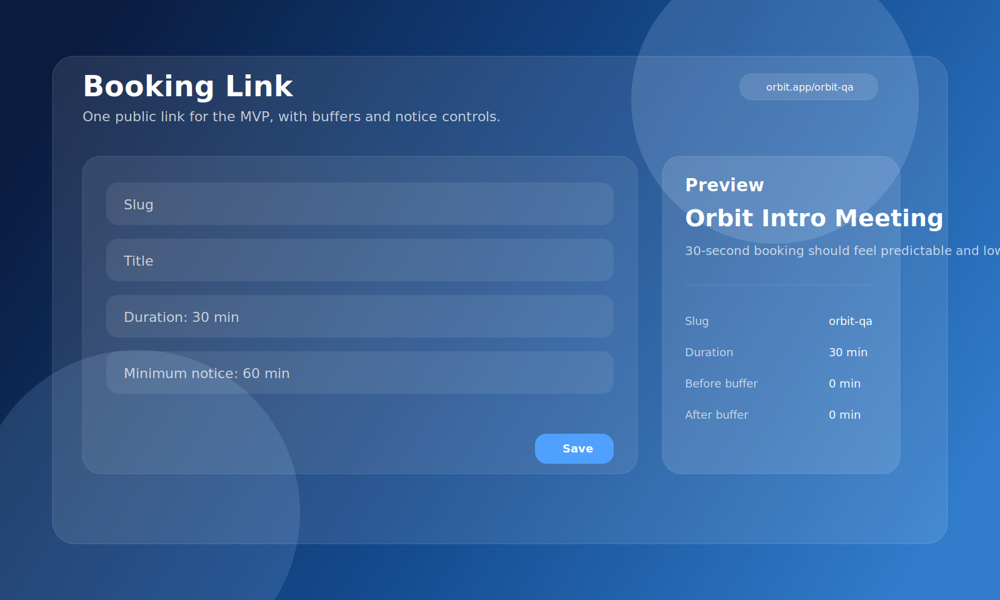
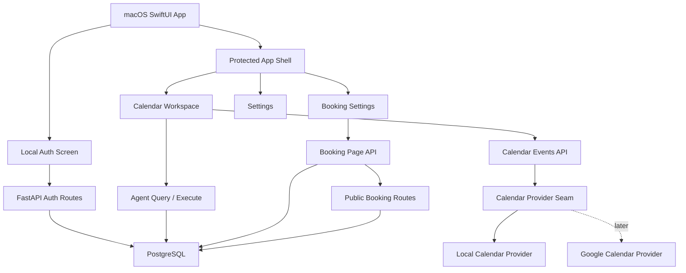
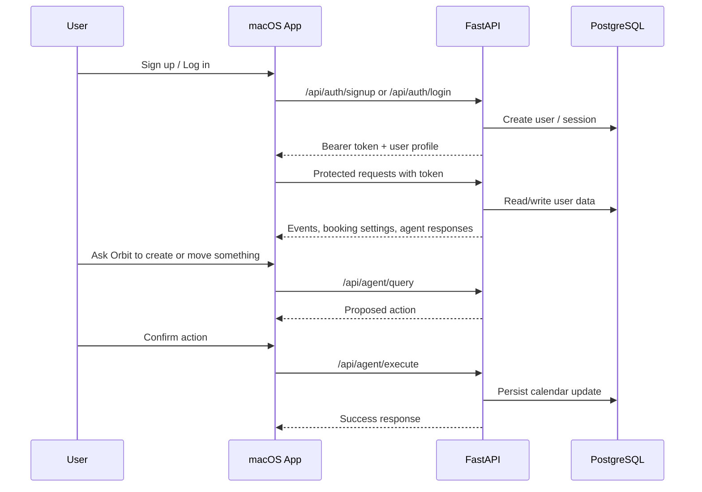

# Orbit Calendar

Orbit Calendar is a native macOS calendar workspace with an action-oriented AI layer on top of scheduling, booking, and time management.

Instead of behaving like a passive calendar viewer, Orbit is designed to help a user:

- authenticate into the app
- inspect upcoming work
- ask for scheduling help in natural language
- confirm agent-driven calendar actions
- publish a booking page for inbound meetings

The current build ships as a local-auth MVP with a native SwiftUI macOS client, a FastAPI backend, PostgreSQL persistence, an agent/action layer, and an unsigned local `.dmg` packaging flow.

## Screenshots

### Auth



### Calendar workspace



### Booking configuration



## Product Summary

North star:

- reduce time wasted in scheduling, context-switching, and meeting setup

Current product shape:

- native macOS client
- local email/password auth
- protected calendar workspace
- agent panel for read and write calendar actions
- booking page configuration
- public booking flow
- local packaging into a `.app` and `.dmg`

## Features

### 1. Native macOS client

- built with SwiftUI
- blue glass, calendar-oriented desktop theme
- dedicated sections for calendar, booking, and settings
- local sign up / login before entering the app

### 2. Local auth flow

- sign up with email, password, display name, and timezone
- login with persistent bearer session
- logout from settings
- protected backend routes for user-specific data

### 3. Calendar workspace

- loads upcoming events for the authenticated user
- seeds local sample events in the current provider mode
- supports event refresh and visual event browsing
- designed around a calendar-first layout instead of generic chat UI

### 4. Agent action layer

- natural-language query input
- intent routing for:
  - `show_schedule`
  - `find_free_time`
  - `create_event`
  - `move_event`
  - `open_booking_settings`
- confirmation modal for write actions
- event creation and move execution through backend tools

### 5. Booking flow

- per-user booking page settings
- unique default slug generation
- timezone-aware public availability lookup
- public booking creation into the user calendar
- overlap protection when a slot is no longer available

### 6. Packaging

- local build of the native executable
- unsigned `.app` wrapper generation
- unsigned `.dmg` generation for local installation/testing

## What Is Implemented vs Deferred

Implemented now:

- local auth
- native macOS flow
- protected backend APIs
- local calendar provider
- booking page and public booking route
- unsigned `.dmg`

Deferred for later:

- Google OAuth
- Google Calendar provider implementation
- signed Apple distribution
- notarization
- production deployment

## How It Works

The app currently uses local auth and a local calendar provider behind a provider seam. That means the desktop client already talks to stable backend contracts while the provider implementation can later switch from `local` to `google`.

### System Graph



### Runtime Flow



## Repository Structure

```text
apps/
  api/      FastAPI backend, Alembic migrations, auth, agent, booking, data model
  macos/    SwiftUI macOS client, app theme, auth screen, calendar UI, packaging output
docs/       product, architecture, and build planning docs
scripts/    packaging helpers
```

## Stack

### Frontend

- SwiftUI
- Swift Package-based macOS app target
- Observation-based local app state

### Backend

- FastAPI
- SQLAlchemy
- Alembic
- PostgreSQL

### Packaging

- Swift build output
- custom `.app` wrapper script
- `hdiutil` for unsigned `.dmg` generation

## Local Setup

### Prerequisites

- macOS
- Python 3.11+
- PostgreSQL running locally
- full Xcode installed and selected:

```bash
sudo xcode-select -s /Applications/Xcode.app/Contents/Developer
xcodebuild -version
```

### Backend setup

```bash
cd apps/api
python3 -m venv .venv
. .venv/bin/activate
pip install -r requirements.txt
cp .env.example .env
createdb orbit_calendar
alembic upgrade head
uvicorn app.main:app --host 127.0.0.1 --port 8000
```

### Run the macOS app

Terminal:

```bash
cd /Users/RISHAV/Developer/Orbit
swift run --package-path apps/macos OrbitCalendarMac
```

Xcode:

```bash
open /Users/RISHAV/Developer/Orbit/apps/macos/Package.swift
```

Then select the `OrbitCalendarMac` scheme and press `Run`.

## Packaging

To build an unsigned local `.dmg`:

```bash
cd /Users/RISHAV/Developer/Orbit
./scripts/package_macos_app.sh
```

Generated artifacts:

- `apps/macos/dist/Orbit Calendar.app`
- `apps/macos/dist/Orbit-Calendar.dmg`

## Release / Install

Current release format:

- unsigned local `.dmg`

Install flow:

1. Build the DMG with `./scripts/package_macos_app.sh`
2. Open `apps/macos/dist/Orbit-Calendar.dmg`
3. Drag `Orbit Calendar.app` into `Applications` or launch it directly for local testing
4. Start the backend locally before using the app

First-run note:

- because the current package is unsigned and not notarized, macOS may require an explicit approval path through `System Settings -> Privacy & Security`

Recommended release checklist:

1. build the backend and native app from a clean git state
2. generate the unsigned `.dmg`
3. attach the `.dmg` to a GitHub Release
4. include version notes covering auth, provider mode, and local setup requirements

## API Surface

### Auth

- `POST /api/auth/signup`
- `POST /api/auth/login`
- `POST /api/auth/logout`
- `GET /api/me`

### Calendar

- `GET /api/calendar/events`
- `POST /api/calendar/sync`

### Agent

- `POST /api/agent/query`
- `POST /api/agent/execute`

### Booking

- `GET /api/booking-page`
- `PUT /api/booking-page`
- `GET /api/public/booking-pages/{slug}`
- `GET /api/public/booking-pages/{slug}/availability`
- `POST /api/public/booking-pages/{slug}/book`

## Current Development Notes

- auth is local email/password, not OAuth
- the calendar provider seam already exists
- `local` provider is active now
- `google` provider is intentionally deferred but can be slotted in later without redesigning the client contract

## License

This project is available under the [MIT License](LICENSE).

## Docs

Supporting product and architecture docs live here:

- [docs/01-mvp-screens-and-flows.md](/Users/RISHAV/Developer/Orbit/docs/01-mvp-screens-and-flows.md)
- [docs/02-backend-schema-and-tool-contracts.md](/Users/RISHAV/Developer/Orbit/docs/02-backend-schema-and-tool-contracts.md)
- [docs/03-codex-build-prompts.md](/Users/RISHAV/Developer/Orbit/docs/03-codex-build-prompts.md)
